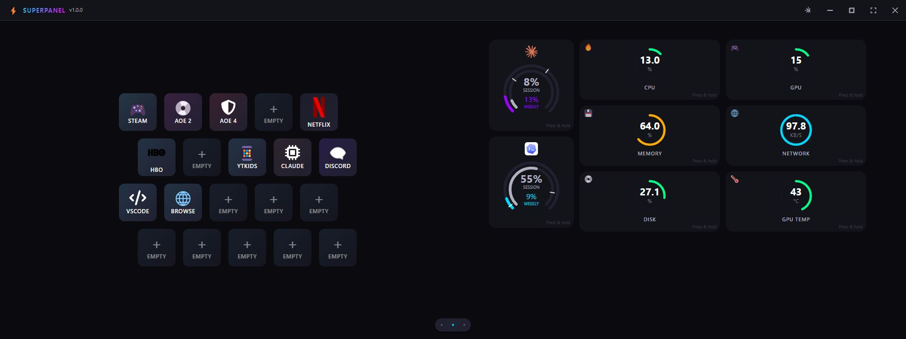

# SuperPanel

A touchscreen-optimized Electron dashboard for Windows with configurable buttons, real-time system metrics, and optional Claude and Codex usage tracking.



## Features

- **Honeycomb Button Grid**: Customizable buttons in a honeycomb layout with visual feedback
- **System Metrics**: Real-time monitoring of CPU, GPU (NVIDIA), RAM, network, disk, and temperature
- **AI Usage Tracking**: Independent Claude and Codex cards with concentric session/weekly usage dials, elapsed-time pace ticks, and detailed usage bars and reset countdowns
- **Touch-Optimized**: Designed for touchscreen displays with proper touch targets (44x44px minimum)
- **Swipe Navigation**: Swipe left/right to switch between buttons and metrics views
- **RGB Dark Theme**: Modern dark theme with RGB accent colors
- **Press & Hold Configuration**: Long-press buttons to configure their actions
- **Multiple Action Types**:
  - Launch applications
  - Run PowerShell commands
  - Open URLs
  - System controls (lock, sleep, restart, shutdown, volume)

## Prerequisites

- Windows PC
- Node.js v24.11.0 (LTS)
- nvm (Node Version Manager)

## Installation

1. **Set the correct Node version**:
   ```bash
   nvm use
   ```

2. **Install dependencies**:
   ```bash
   npm install
   ```

## Development

Run the app in development mode:

```bash
npm run electron:dev
```

This will:
- Start the Vite dev server on port 5173
- Launch the Electron app
- Enable hot module replacement
- Open DevTools automatically

## Building

### Development Build

```bash
npm run build
```

### Production Build (Windows Installer)

```bash
npm run electron:build:win
```

This creates a Windows installer in the `dist-electron` directory.

### Tests

```bash
npm test
```

## Releases and Updates

Every pull request runs the tests and a packaging check in GitHub Actions. Every merge to `main` publishes a new [GitHub release](https://github.com/bdgould/super-panel/releases) with a Windows installer.

After you install SuperPanel, it checks for new releases on its own. It downloads them in the background and installs them the next time the app closes. To install an update right away, tap **Restart to update** in the title bar. You can also check for updates manually in **Settings**.

Each release bumps the patch version by default. For a minor or major release, raise `version` in `package.json` in your pull request.

## Usage

### Configuring Buttons

1. **Long-press** (800ms) any button to open the configuration modal
2. Set the button appearance:
   - Label (up to 20 characters)
   - Icon (emoji or character)
   - Color (hex color picker)
3. Choose an action type and configure it:
   - **Launch Application**: Provide the full path to the executable
   - **Run Command**: Enter a PowerShell command
   - **Open URL**: Enter a website URL or file path
   - **System Control**: Select from lock, sleep, restart, shutdown, or volume controls
4. Click **Save** to apply changes

### Swipe Navigation

- **Swipe Right**: Show buttons only
- **Swipe Left**: Show metrics only
- **Tap Indicators**: Click the dots at the bottom to switch views
  - Left dot: Buttons only
  - Middle dot: Split view (default)
  - Right dot: Metrics only

### Claude and Codex Usage Cards

In **Settings → AI usage**, connect Claude, Codex, or both. Enable **Show on dashboard** for each card you want, then **Save**. Cards stay hidden until configured and enabled; connecting an account is immediate, while Save/Cancel controls its dashboard visibility.

The cards appear beside the system metrics in split and metrics-only views:

- **Inner ring:** session usage. **Outer ring:** weekly usage. The percentages and labels inside match their ring colors.
- **White ticks:** the elapsed share of each window, showing where consumption would sit at an even pace. These are budgeting references, not predictions.
- **Press and hold (800ms):** open per-window usage bars, pace comparisons, reset countdowns, exact reset times, and the last reading time. Reset and update text stay in the expanded view to keep the cards compact.

Usage shows the percentage of the subscription allowance consumed, rather than a token count. Claude reads your web account directly, so Claude Code can be closed. Codex uses an installed Codex runtime with a separate SuperPanel sign-in; no coding session needs to be running.

Usage refreshes every three minutes while the app is visible, pauses while minimized or disabled, and marks stale readings. At a reset, SuperPanel waits for a new reading instead of guessing zero usage. Disabling retains the connection; Disconnect clears only SuperPanel's provider authentication.

See [AI usage setup and troubleshooting](docs/ai-usage.md) for workspace selection, choosing a Codex executable, reconnecting, and credential storage.

### Keyboard Shortcuts

- **F11**: Toggle fullscreen
- **Ctrl+Shift+I**: Open DevTools (development only)

## Project Structure

```
super-panel/
├── electron/                 # Electron main process
│   ├── main.js              # Main entry point
│   ├── preload.cjs          # Preload script (security)
│   ├── usage/               # Provider adapters, normalization, and polling
│   └── ipc/                 # IPC handlers
│       ├── metrics.js       # System metrics
│       ├── actions.js       # Button actions
│       ├── config.js        # Configuration management
│       └── usage.js         # AI account and usage operations
├── src/                     # React application
│   ├── components/          # React components
│   │   ├── Dashboard/       # Main dashboard
│   │   ├── HoneycombGrid/   # Button grid
│   │   ├── MetricsPanel/    # System metrics
│   │   ├── UsagePanel/      # Claude and Codex usage cards
│   │   └── ConfigModal/     # Button configuration
│   ├── contexts/            # React contexts
│   │   ├── ConfigContext.jsx
│   │   ├── MetricsContext.jsx
│   │   └── UsageContext.jsx
│   ├── hooks/               # Custom hooks
│   │   ├── useSwipe.js
│   │   └── useLongPress.js
│   ├── styles/              # Global styles
│   │   ├── global.css
│   │   └── theme.css
│   ├── utils/               # Utilities
│   │   └── constants.js
│   ├── App.jsx              # Root component
│   └── main.jsx             # React entry point
├── public/                  # Static files
│   └── index.html
├── .nvmrc                   # Node version
├── package.json
├── vite.config.js
└── README.md
```

## Configuration Storage

Button configurations and app settings are stored using `electron-store` in:
```
%APPDATA%\super-panel\super-panel-config.json
```

Metrics refresh every 6 seconds by default. Change this under **Settings → Metrics Refresh** (gear icon in the title bar). Polling pauses while the window is minimized.

## Touch Optimizations

- All interactive elements use `touch-action: manipulation` to prevent delays
- Minimum touch target size: 44x44px
- Visual feedback within 100ms
- Swipe threshold: 50px minimum distance
- Long-press threshold: 800ms

## System Requirements

- Windows 10 or later
- Touchscreen display (optional, works with mouse/keyboard)
- 4GB RAM minimum
- 200MB disk space

## Troubleshooting

### Temperature data not available
Many Windows systems expose no CPU temperature sensor. When that happens the Temperature card shows the NVIDIA GPU temperature instead. Some systems require administrator privileges to access temperature sensors, so running as administrator may help.

### GPU card not showing
The GPU card needs an NVIDIA GPU and driver, which provide `nvidia-smi`. AMD and Intel GPUs are not supported yet.

### AI usage card not showing or updating
Check that the account is connected, **Show on dashboard** is enabled, and the settings were saved. Switch from buttons-only to split or metrics-only view. Use Reconnect if sign-in expired; temporary network failures retain the last reading. Codex requires an installed runtime and a ChatGPT account. See the [AI usage guide](docs/ai-usage.md) for provider-specific steps.

### Commands not executing
Ensure PowerShell execution policy allows scripts:
```powershell
Set-ExecutionPolicy -ExecutionPolicy RemoteSigned -Scope CurrentUser
```

### App won't start
1. Verify Node version: `node --version` (should be v24.11.0)
2. Delete `node_modules` and reinstall: `npm install`
3. Check console for errors in DevTools

## Security

- Context isolation enabled
- Node integration disabled in renderer
- Preload script exposes only necessary IPC methods
- All user inputs validated before execution
- Command execution sandboxed via PowerShell

## License

MIT

## Contributing

This is a personal project. Feel free to fork and modify for your own use.
